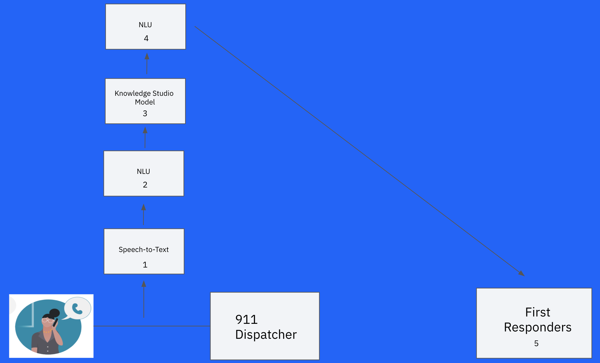
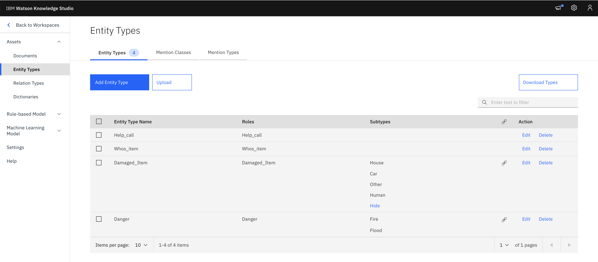
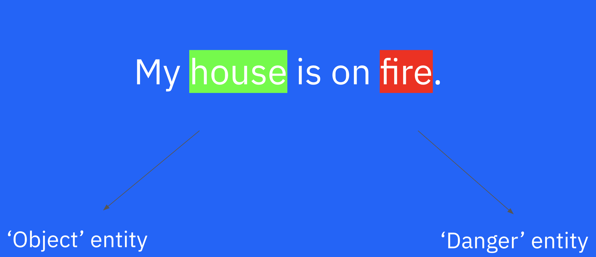
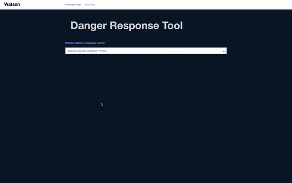

# Building a Watson Danger Response Tool with Custom NLU Domain Model

In moments of a disaster such as fires, floods, and shootings, victims need first response care as soon as possible. For example, the 2018 ‘Camp Fire’ in Northern California wiped out the town of Paradise, killing 85 people, and causing $16.5 billion in damages. In this case, and in many similar situations, the difference between a few seconds in response time meant not only lives saved, but millions and even billions of dollars salvaged in the potential destruction of valuable assets. 

How can we develop a solution that will reduce the response time of first responders, and provide a positive impact for those who need it most? Well, when a victim is normally in danger, they call 911 and begin a dialogue with a dispatcher. While this conversation is ongoing, the Watson Danger Response Tool will screen the conversation for select dangers including fires and floods. If one of those dangers are identified, the appropriate authorities will be immediately alerted, thus shaving off precious seconds and sometimes even minutes off the response time. In this code pattern, using the power of Watson AI, we will create this danger response web app.

Built with React components and a Node.js server, the app will capture audio input and stream it to a Watson Speech to Text service. After the input speech is transcribed, it will be sent to a Watson Natural Language Understanding service that will identify, categorize, and score the danger threat in the text. Both the input speech and the danger analysis will be displayed in the app. 

The key aspect of this tool is the NLU. Using Knowledge Studio, we will train a custom machine learning model for the ‘relations’ feature of the Watson NLU in order to drive the decision-making process of identifying the danger. We will create an ‘entity’ for the danger itself, and corresponding subcategories for each of the dangers-of-interest, for example ‘fire’ and ‘flood’. We will also create an ‘entity’ for the object that the danger is acting on. 

The model will then identify and categorize the danger by reaching a minimum confidence threshold for a particular subcategory of danger. Additionally, the model will determine the severity of the danger, by analyzing the strength of the relation between the danger and object entities. 

When you have completed this code pattern, you will understand how to:

* Stream audio to Speech to Text using a WebSocket
* Use Natural Language Understanding with a REST API
* Retrieve and parse text from Speech to Text using a REST API
* Integrate Speech to Text, Natural Language Understanding, and Knowledge Studio in a web app 
* Use React components and a Node.js server

> **NOTE**: This code pattern includes instructions for running Watson services on IBM Cloud or with the Watson API Kit on IBM Cloud Pak for Data.
> Click [here](https://www.ibm.com/products/cloud-pak-for-data) for more information about IBM Cloud Pak for Data.

## Flow

1. User selects their preferred language.
1. User presses the microphone button and captures the input audio.
1. The audio is streamed to Speech to Text using a WebSocket.
1. The transcribed text from Speech to Text is displayed and updated.
1. The transcribed text is sent to NLU for danger analysis and output is displayed.

## Steps

1. [Create the Watson services](#create-the-watson-services)
2. [Deploy the server](#deploy-the-server)
3. [Use the web app](#use-the-web-app)

### Create the Watson services

> Note: You can skip this step if you will be using the `Deploy to Cloud Foundry on IBM Cloud` button below. That option automatically creates the services and binds them (providing their credentials) to the application.

Provision the following services:

* **Speech to Text**
* **Natural Language Understanding**

The instructions will depend on whether you are provisioning services using IBM Cloud Pak for Data or on IBM Cloud.

Click to expand one:

<b>IBM Cloud Pak for Data</b>

<i>Use the following instructions for each of the three services.</i>

<h5>Install and provision service instances</h5>

The services are not available by default. An administrator must install them on the IBM Cloud Pak for Data platform, and you must be given access to the service. To determine whether the service is installed, Click the <b>Services</b> icon () and check whether the service is enabled.

<h5>Gather credentials</h5>

<ol>
    <li>For production use, create a user to use for authentication. From the main navigation menu (☰), select <b>Administer > Manage users</b> and then <b>+ New user</b>.</li>
    <li>From the main navigation menu (☰), select <b>My instances</b>.</li>
    <li>On the <b>Provisioned instances</b> tab, find your service instance, and then hover over the last column to find and click the ellipses icon. Choose <b>View details</b>.</li>
    <li>Copy the <b>URL</b> to use as the <b>{SERVICE_NAME}_URL</b> when you configure credentials.</li>
    <li><i>Optionally, copy the <b>Bearer token</b> to use in development testing only. It is not recommended to use the bearer token except during testing and development because that token does not expire.</i></li>
    <li>Use the <b>Menu</b> and select <b>Users</b> and <b>+ Add user</b> to grant your user access to this service instance. This is the user name (and password) you will use when you configure credentials to allow the Node.js server to authenticate.</li>
</ol>

<b>IBM Cloud</b>

<h5>Create the service instances</h5>
  <ul>
    <li>If you do not have an IBM Cloud account, register for a free trial account <a href="https://cloud.ibm.com/registration">here</a>.</li>
    <li>Click <a href="https://cloud.ibm.com/catalog/services/speech-to-text">here</a> to create a <b>Speech to Text</b> instance.</li>
    <li>Click <a href="https://cloud.ibm.com/catalog/services/natural-language-understanding">here</a> to create a <b>Language Translator</b> instance.</li>
  </ul>
<h5>Gather credentials</h5>
  <ol>
    <li>From the main navigation menu (☰), select <b>Resource list</b> to find your services under <b>Services</b>.</li>
    <li>Click on each service to find the <b>Manage</b> view where you can collect the <b>API Key</b> and <b>URL</b> to use for each service when you configure credentials.
  </ol>

## Deploy the server

Click on one of the options below for instructions on deploying the Node.js server.

|   |   |   |   |
| - | - | - | - |
|  |  |  |

## Use the web app

> NOTE: The app was developed using Chrome on macOS. Browser compatibility issues are still being worked out.

1. Browse to your app URL

   * Use the URL provided at the end of your selected deployment option.

1. Select the language of your choice

   * The drop-down will be populated with models supported by your Speech to Text service.
     
1. Use the Speech to Text toggle

   * Use the `Speak Here` button (which becomes `Stop Listening`) to begin recording audio
     and streaming it to Speech to Text. Press the button again to stop listening/streaming.
     
1. Use the Detect Danger toggle

   * Use the `Detect Danger` button (which becomes `Detecting Danger`) to begin running the NLU and executing danger analysis. Press the button again to stop when output has been printed.
     
1. Resetting the transcribed text

   * The transcribed text will be cleared when you do any of the following:
   
     * Press `Speech to Text` to restart listening
     * Refresh the page
     
## Future Features
  * With additional time and resources, here are some features that can be implemented to supplement the current code pattern. 
    * Maps API - Parse the location of the danger incident using ‘Entities’ NLU feature and pin the location on a visual map.

    * Database - Store voice inputs in a database that can be used to periodically retrain and improve the model over time.

    * User Log - Using ‘Concepts’ NLU feature, summarize important information like location, time, and environment from voice input. This summary can be passed on to first responders so they are prepared, even before they approach the danger. 

    * Diversify Input Sources - Scrape social media forums (twitter, facebook) and other miscellaneous sources (ex: police radio) for danger statements and analyze accordingly. 

## License

This code pattern is licensed under the Apache License, Version 2. Separate third-party code objects invoked within this code pattern are licensed by their respective providers pursuant to their own separate licenses. Contributions are subject to the [Developer Certificate of Origin, Version 1.1](https://developercertificate.org/) and the [Apache License, Version 2](https://www.apache.org/licenses/LICENSE-2.0.txt).

[Apache License FAQ](https://www.apache.org/foundation/license-faq.html#WhatDoesItMEAN)
